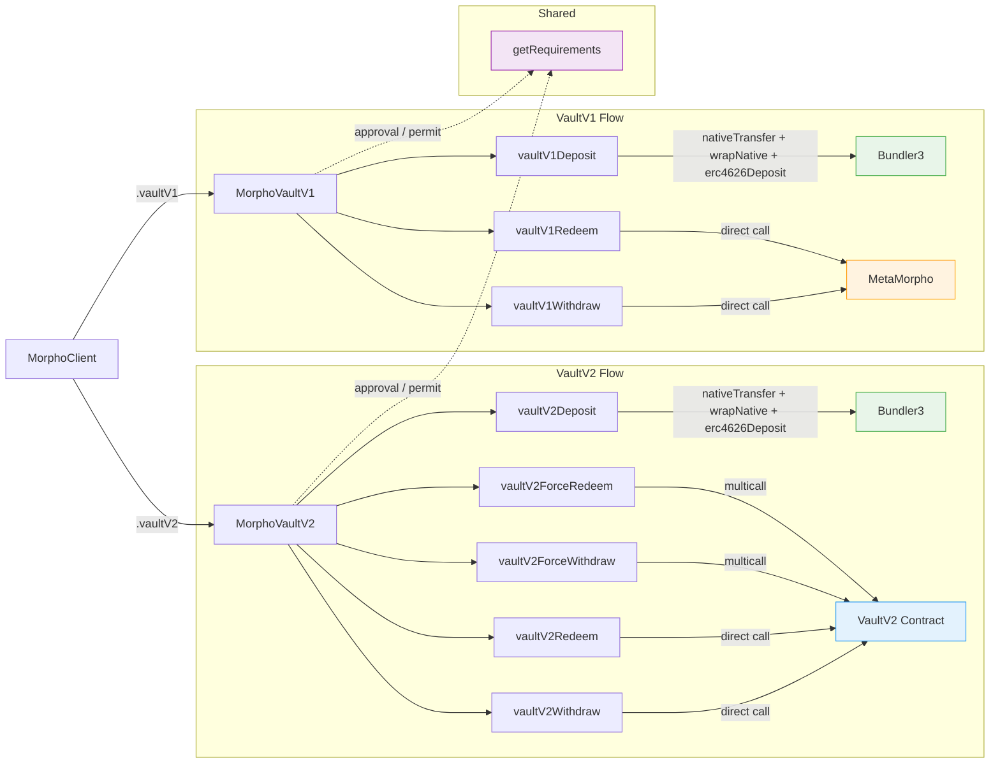

# Consumer SDK


> ⚠️ **Experimental package**: This SDK is currently in experimental phase.

> **The abstraction layer that simplifies Morpho protocol**

## Entities & Actions

| Entity      | Action          | Route                     | Why                                                                                     |
| ----------- | --------------- | ------------------------- | --------------------------------------------------------------------------------------- |
| **VaultV2** | `deposit`       | Bundler (general adapter) | Enforces `maxSharePrice` — inflation attack prevention. Supports native token wrapping. |
|             | `withdraw`      | Direct vault call         | No attack surface, no bundler overhead needed                                           |
|             | `redeem`        | Direct vault call         | No attack surface, no bundler overhead needed                                           |
|             | `forceWithdraw` | Vault `multicall`         | N `forceDeallocate` + 1 `withdraw` in a single tx                                       |
|             | `forceRedeem`   | Vault `multicall`         | N `forceDeallocate` + 1 `redeem` in a single tx                                         |
| **VaultV1** | `deposit`       | Bundler (general adapter) | Same ERC-4626 inflation attack prevention as V2. Supports native token wrapping.        |
|             | `withdraw`      | Direct vault call         | No attack surface                                                                       |
|             | `redeem`        | Direct vault call         | No attack surface                                                                       |

## VaultV2

```typescript
import { MorphoClient } from "@morpho-org/consumer-sdk";
import { createPublicClient, http } from "viem";
import { mainnet } from "viem/chains";

const viemClient = createPublicClient({ chain: mainnet, transport: http() });
const morpho = new MorphoClient(viemClient);

const vault = morpho.vaultV2("0xVault...", 1);
```

### Deposit

```typescript
const { buildTx, getRequirements } = await vault.deposit({
  amount: 1000000000000000000n,
  userAddress: "0xUser...",
});

const requirements = await getRequirements();
const tx = buildTx(requirementSignature);
```

#### Deposit with native token wrapping

For vaults whose underlying asset is wNative, you can deposit native token that will be automatically wrapped:

```typescript
// Native ETH only — wraps 1 ETH to WETH and deposits
const { buildTx, getRequirements } = await vault.deposit({
  nativeAmount: 1000000000000000000n,
  userAddress: "0xUser...",
});

// Mixed — 0.5 WETH (ERC-20) + 0.5 native ETH wrapped to WETH
const { buildTx, getRequirements } = await vault.deposit({
  amount: 500000000000000000n,
  nativeAmount: 500000000000000000n,
  userAddress: "0xUser...",
});
```

The bundler atomically transfers native token, wraps it to wNative, and deposits alongside any ERC-20 amount. The transaction's `value` field is set to `nativeAmount`.

### Withdraw

```typescript
const { buildTx } = vault.withdraw({
  amount: 500000000000000000n,
  userAddress: "0xUser...",
});

const tx = buildTx();
```

### Redeem

```typescript
const { buildTx } = vault.redeem({
  shares: 1000000000000000000n,
  userAddress: "0xUser...",
});

const tx = buildTx();
```

### Force Withdraw

```typescript
const { buildTx } = vault.forceWithdraw({
  deallocations: [{ adapter: "0xAdapter...", amount: 100n }],
  withdraw: { amount: 500000000000000000n },
  userAddress: "0xUser...",
});

const tx = buildTx();
```

### Force Redeem

```typescript
const { buildTx } = vault.forceRedeem({
  deallocations: [{ adapter: "0xAdapter...", amount: 100n }],
  redeem: { shares: 1000000000000000000n },
  userAddress: "0xUser...",
});

const tx = buildTx();
```

## VaultV1

```typescript
const vault = morpho.vaultV1("0xVault...", 1);
```

### Deposit

```typescript
const { buildTx, getRequirements } = await vault.deposit({
  amount: 1000000000000000000n,
  userAddress: "0xUser...",
});

const requirements = await getRequirements();
const tx = buildTx(requirementSignature);
```

### Withdraw

```typescript
const { buildTx } = vault.withdraw({
  amount: 500000000000000000n,
  userAddress: "0xUser...",
});

const tx = buildTx();
```

### Redeem

```typescript
const { buildTx } = vault.redeem({
  shares: 1000000000000000000n,
  userAddress: "0xUser...",
});

const tx = buildTx();
```

## Architecture



## Local Development

Link this package to your app for local debugging:

```bash
# In this consumer-sdk project
pnpm run build:link
```

In your other project:

```bash
# Link the local package
pnpm link consumer-sdk
```

## Contributing

Contributions are welcome! Feel free to open an issue or PR.
